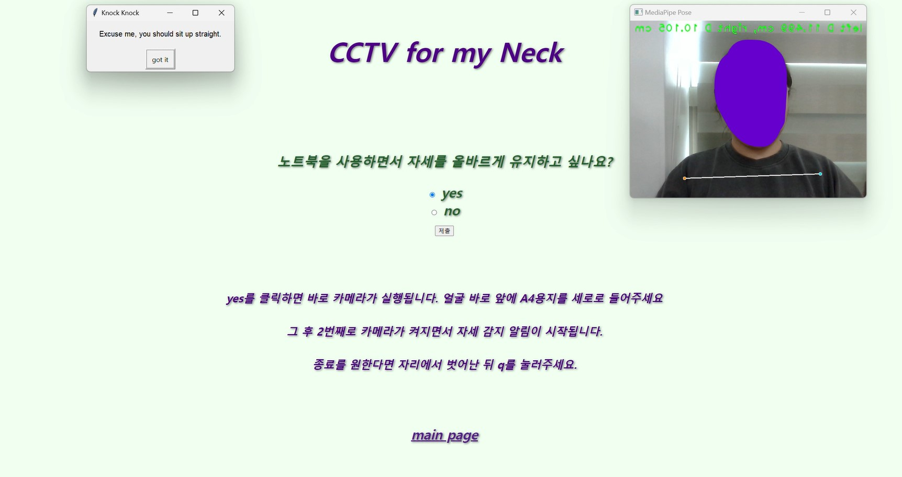
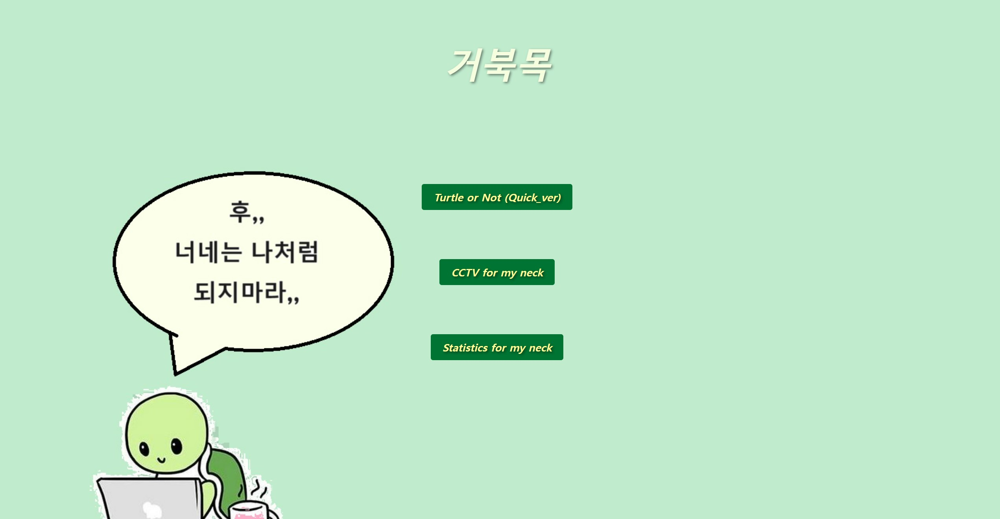
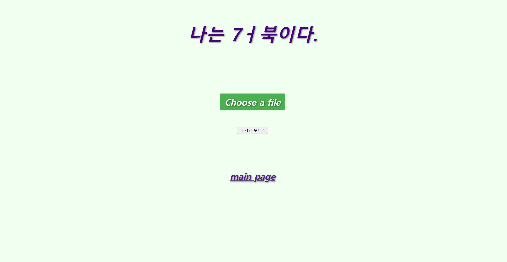
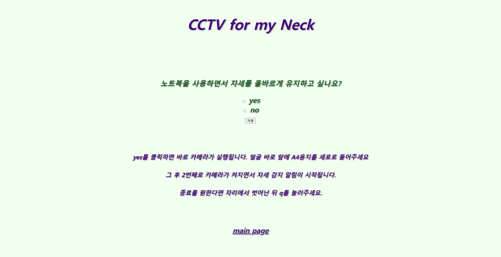
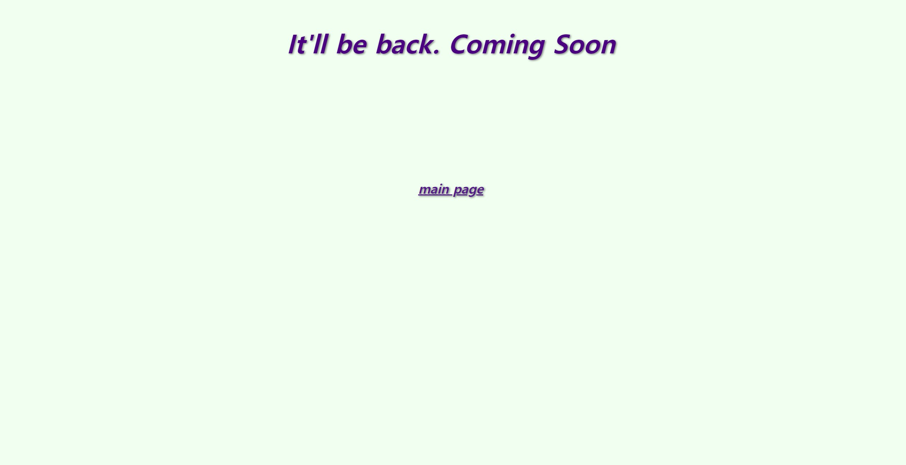

# KDT_project_13_ABS_CLOUD

---     
### 주제 선정 배경
KDT 4개월차로 안그래도 있었던 거북목이 점점 심해져가는 것을 느꼈다.           
누가 옆에서 나쁜 자세를 하고 있다면 알려줬으면 하는 생각이 들었다.         
마치 헬스 개인 PT 받으면 옆에서 코치 쌤이 자세 봐주듯이 말이다.        
그래서 자세 교정 프로그램을 만들고자 한다.                
가장 핵심적으로 구현하는 바는 노트북에 실행시켜서 거북목이거나 바르지 않은 자세가 나올 경우 경고 메시지가 뜨는 것이다.   

            

△ 실제 시연되는 사진 
---     

### 모델 생성
1. 데이터 준비
   - 크롬 이용 (관련 키워드 검색하여 사진 다운로드 및 필터링 후 사용)
   - 게임 캐릭터 이용 (게임 캐릭터의 옆모습을 캡처하여 필터링 후 사용)
2. 전처리
    - 사진 크기 통일 (150, 150)
    - random crop
    - 텐서화
    - 정규화
3. Dataset & Dataloader 생성
4. 모델 및 하이퍼 파라미터 정의 : Resnet18을 활용한 전이학습 사용
5. 학습 실시
6. 성능 평가         

| 평균치 | train | valid | test |
|--------|-------|-------|------|
| loss   | 0.93  | 0.95  | 0.84 |
| accuracy | 0.51 | 0.51 | 0.47 |
| precision | 0.55 | 0.58 | 0.58 |
| recall | 0.59 | 0.57 | 0.45 |
| f1-score | 0.52 | 0.54 | 0.46 |

---     

### 객체 인식

- Google에서 개발한 오픈 소스 프레임워크인 mediapipe를 활용함
- 좌표값이 사이의 거리를 구하는 것이 픽셀을 단위로 나옴    
    => *이를 cm 단위로 변환 과정이 필요함*       
          
  
######  * 픽셀값을 cm 단위로 변환 후 거북목 탐지까지의 과정 (간략화)
(1)  A4용지를 이용하여 픽셀과 실제 길이의 비율을 구함          
(2) 그 비율을 이용해서 실시간으로 사용자의 어깨 중앙선과 귀 사이의 거리(D) 측정함      
(3) 그 거리값(D)이 기준값을 넘을 경우 경고 알림창이 나타남         

---     

### 웹 구축
- flask 와 blueprint를 활용하여 웹을 구축함

###### 메인 페이지

###### 1번 기능 웹페이지

###### 2번 기능 웹페이지

###### 3번 기능 웹페이지

